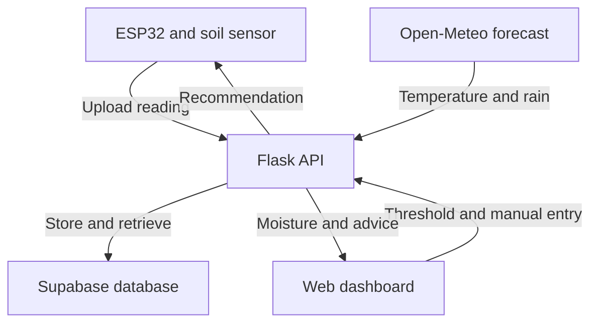

# Smart Garden Advisory System

ESP32 soil sensing, weather-aware watering recommendations, and a full-stack dashboard for a family garden.

This repository documents the hardware, firmware, backend, and web interface for a garden advisory system. A calibrated soil sensor reports to an ESP32; a Flask API combines those readings with local weather forecasts; a browser dashboard helps the gardener decide when to water.

I built the system for my family's backyard garden. During a three-week deployment, the dashboard helped us skip watering on rainy days and keep track of when plants needed attention.

[Open the dashboard](https://smart-garden-advisory-system.vercel.app) · [Browse the source](https://github.com/KrishnaChouturi/Smart-Garden-Advisory-System)

The dashboard depends on a hosted backend and incoming sensor readings. Its availability and data freshness depend on those services and the field unit.

---

## Overview

A fixed watering schedule does not account for soil that is already wet or rain expected later in the day. Checking the soil and forecast separately works, but it adds a recurring task for whoever looks after the garden.

This project brings those inputs together. The field unit measures soil moisture, the backend compares it with a selected threshold and the day's forecast, and the dashboard displays a watering recommendation. Users can also record their own watering choice.

The work spans sensor calibration, embedded firmware, database design, REST APIs, frontend development, and deployment. Keeping the recommendation logic in the backend makes it possible to change the rules without reflashing the sensor.

The current build provides **watering advice**. Watering remains a manual action; a relay, valve, and solar supply are future extensions.

## Design Question

> Can an inexpensive soil sensor and a live weather forecast provide useful watering guidance through a dashboard that a family can use in its own garden?

---

## Project Summary

| Category | Implementation |
|---|---|
| Application | A single monitored plant or garden location |
| Initial deployment | Three weeks in a family backyard garden |
| Field controller | ESP32 WROOM |
| Sensor | Capacitive soil moisture sensor v1.2 |
| Sampling | Five analog readings averaged during each wake cycle |
| Sleep interval | 3,600 seconds between active cycles |
| Calibration references | Dry: 2665; wet: 1049 |
| Backend | Python, Flask, Flask-CORS, requests |
| Database | Supabase PostgreSQL |
| Weather source | Open-Meteo Forecast API |
| Frontend | HTML, CSS, JavaScript |
| Deployment | Vercel frontend; current source points to a Render backend |
| Automatic recommendations | None, Small, Medium, Large |
| Manual choices | None, Small, Medium, Ample, Large |
| Core hardware budget | Approximately $30–50 target, excluding optional extensions |

Earlier build notes describe a Railway deployment and additional control endpoints. The setup and API reference below follow the code currently in this repository.

## Results at a Glance

| Area | Completed work | What it establishes |
|---|---|---|
| Sensor calibration | Measured dry and wet references; averaged five samples per reading | Raw sensor output becomes a consistent relative moisture indicator |
| Hardware-to-cloud connection | ESP32 posts readings to Flask for storage in Supabase | Physical observations reach the database |
| Recommendation engine | Combines moisture deficit, temperature, and a rain forecast | Advice responds to current inputs rather than a fixed calendar |
| Full-stack deployment | Connected a hosted dashboard, API, database, and field unit | The system can be accessed beyond the development computer |
| Family use | Used the dashboard during a three-week garden deployment | Recommendations supported watering decisions, including skipping rain-day watering |

These are implementation and use results. Water consumption, plant growth, and time savings were not measured in a controlled comparison, so this project does not report a percentage reduction in water use.

---

## System Architecture



The ESP32 handles sensing and communication. Flask evaluates the watering rules. Supabase stores sensor readings and recommendation or manual-entry records. The frontend displays weather, soil moisture, and the resulting advice.

The firmware and dashboard both request recommendations from the same API, although they currently supply their own threshold values.

---

## Hardware

| Component | Purpose |
|---|---|
| ESP32 WROOM development board | Reads the sensor, connects to Wi-Fi, and enters deep sleep |
| Capacitive soil moisture sensor v1.2 | Produces an analog signal that changes with moisture |
| Jumper wiring | Connects sensor power, ground, and analog output |
| Weather-resistant enclosure | Houses the controller during outdoor use |
| Suitable board power supply | Powers the field unit; USB is sufficient for bench testing |

The sensor output connects to **GPIO 34**. The documented build uses the ESP32's **3.3 V** supply and a shared ground. Ventilation and reflective covering were incorporated into the enclosure to manage heat during outdoor deployment.

### Sensor Calibration

The firmware uses two measured reference values:

| Reference | Raw ADC value | Displayed value |
|---|---:|---:|
| Dry reference | 2665 | 0% |
| Wet reference | 1049 | 100% |

During each wake cycle, the ESP32 takes five readings, separated by 50 milliseconds, and averages them before applying the mapping:

```cpp
int rawAnalog = rawSum / 5;
int moisturePercent = map(rawAnalog, 2665, 1049, 0, 100);
moisturePercent = constrain(moisturePercent, 0, 100);
```

The displayed percentage is a **relative index between these reference points**, not a laboratory measurement of volumetric soil water content. A different sensor or soil setup needs its own calibration. Averaging reduces short-term variation; it does not eliminate all sensor error.

### Firmware Cycle

Each wake cycle performs the following steps:

1. Initialize serial output and attempt a Wi-Fi connection.
2. Read and average five sensor samples.
3. Map the result to the 0–100 index and upload it to the backend.
4. Request a recommendation using the firmware's current threshold of 40.
5. Print the returned advice and enter deep sleep for one hour.

Wi-Fi connection attempts are bounded; a connection timeout sends the board back to sleep. The active portion adds some time to the one-hour sleep interval. Actual battery life depends on the complete board and power supply, not just the ESP32's chip-level sleep specification.

---

## Software Pipeline

| Layer | Tools | Responsibility |
|---|---|---|
| Firmware | Arduino C++, ESP32 core, ArduinoJson | Sampling, calibration, HTTP requests, sleep scheduling |
| Backend | Flask, requests, Flask-CORS | Weather retrieval, recommendation rules, database operations |
| Persistence | Supabase PostgreSQL | Soil readings and watering-related records |
| Frontend | HTML, CSS, JavaScript Fetch API | Weather display, threshold input, recommendations, manual entries |
| Web hosting | Vercel and a Python application host | Serve the frontend and Flask API independently |

### Database Records

The current backend uses two tables and a fixed `DEFAULT_PLANT_ID = 1`:

| Table | Fields read or written by the application |
|---|---|
| `soil_readings` | `plant_id`, `moisture_level`, `created_at` |
| `watering_history` | `plant_id`, `amount_recommended`, `amount_applied`, `log_type` |

The latest soil reading is selected by `created_at`. Each recommendation request appends a system record with `amount_applied` set to `Pending`. A manual entry stores the user's selected label in both amount fields.

The history records software decisions and user entries. It does not independently verify that water was applied, and the current recommendation calculation does not use past watering records as an input.

---

## Watering Recommendation Logic

The engine applies a small set of explicit rules. It uses the latest soil reading, a requested moisture threshold, current temperature, and today's forecast rain total. It does not use a trained machine-learning model.

The default threshold is **40**. A forecast rain total **greater than 0.5 mm** sets the rain flag. The table below follows the current backend's decision order.

| Condition | Automatic result |
|---|---|
| Moisture is below target and the rain flag is set | None |
| Moisture is below target, no rain flag, and deficit >25 or temperature >85°F | Large |
| Moisture is below target, no rain flag, and deficit >15 after the previous condition is excluded | Medium |
| Moisture is below target, no rain flag, and neither larger-deficit rule applies | Small |
| Moisture is at or above target by less than 5, temperature >90°F, and no rain flag | Small |
| All other cases | None |

**Ample is available as a manual choice but is not currently generated by the automatic rules.** The labels are qualitative amounts; the repository does not convert them to measured liters or verified valve durations.

The forecast flag uses the day's total rain forecast. It does not isolate rainfall that will occur strictly after the moment of the request.

## Dashboard

The browser interface has three main sections:

- **Weather:** current temperature, humidity, rainfall, and the forecast rain flag.
- **Soil and advice:** the latest moisture index, an editable target threshold, and a button to calculate a recommendation.
- **Manual entry:** a five-level selection that records the user's watering choice and updates the displayed label.

The target input is sent with each calculation request. Changing it in the browser does not persist a shared threshold or change the firmware's value of 40. Weather and soil requests run on page load; the interface is not a continuous live stream.

---

## API Reference

| Method | Endpoint | Request | Behavior |
|---|---|---|---|
| GET | `/test-weather` | None | Returns current weather and today's rain flag |
| POST | `/api/submit-reading` | `{"moisture_level": 35}` | Stores a soil reading; returns HTTP 201 on success |
| POST | `/compute-recommendation` | `{"target_threshold": 40}` | Reads the latest soil value, fetches weather, computes advice, and logs a system entry |
| POST | `/manual-watering` | `{"amount": "Small"}` | Records a manual choice; returns HTTP 201 on success |

`/compute-recommendation` returns HTTP 400 when no soil readings exist. It writes a history record each time it succeeds, including when the dashboard requests soil data on page load.

The current source has no history-retrieval route or hardware control-signal route. It also contains no relay actuation code.

---

## Validation and Engineering Lessons

The build notes document testing at the sensor, API, and interface levels:

- Established dry and wet sensor references and confirmed the mapped values in serial output.
- Transmitted a sensor reading through the API and received an HTTP 201 response.
- Exercised recommendation and manual-entry requests against the database.
- Resolved frontend/backend cross-origin requests during deployment.
- Loaded the hosted interface from a phone using a separate cellular connection.

Three practical lessons shaped the implementation:

**Calibration comes before interpretation.** A raw analog value needs reference points before it can support a useful threshold. Five-sample averaging helps stabilize the display, but placement and soil conditions still affect the measurement.

**A complete board draws more power than a sleeping chip.** Deep sleep reduces active work, but regulator and development-board consumption affect field runtime. Power improvements need measurements on the assembled unit.

**Deployment is part of the engineering work.** Database credentials, host ports, cross-origin requests, and matching API URLs all had to work together before the dashboard could display sensor data away from the development machine.

---

## Repository Structure

| Path | Contents |
|---|---|
| [`firmware-esp32.ino`](firmware-esp32.ino) | Sensor sampling, calibration, uploads, recommendation requests, deep sleep |
| [`backend-flask/app.py`](backend-flask/app.py) | Flask API and watering rules |
| [`backend-flask/requirements.txt`](backend-flask/requirements.txt) | Pinned Python dependencies |
| [`backend-flask/Procfile`](backend-flask/Procfile) | Gunicorn start command |
| [`frontend-web/index.html`](frontend-web/index.html) | Dashboard structure and controls |
| [`frontend-web/styles.css`](frontend-web/styles.css) | Dashboard styling |
| [`frontend-web/app.js`](frontend-web/app.js) | API requests and interface updates |

---

## Running the Project

### 1. Clone and Install

Use Python 3.12, Git, and an isolated environment:

```bash
git clone https://github.com/KrishnaChouturi/Smart-Garden-Advisory-System.git
cd Smart-Garden-Advisory-System/backend-flask
python -m venv .venv
```

Activate the environment:

```bash
# macOS / Linux
source .venv/bin/activate
```

```powershell
# Windows PowerShell
.\.venv\Scripts\Activate.ps1
```

Then install the dependencies:

```bash
python -m pip install -r requirements.txt
```

### 2. Configure Supabase

Use your own Supabase project. The repository does not include database migrations. The following is a minimal schema for a fresh installation that matches the fields used by the current API:

```sql
create table if not exists public.soil_readings (
    id bigint generated by default as identity primary key,
    created_at timestamptz not null default now(),
    plant_id integer not null default 1,
    moisture_level integer not null check (moisture_level between 0 and 100)
);

create table if not exists public.watering_history (
    id bigint generated by default as identity primary key,
    created_at timestamptz not null default now(),
    plant_id integer not null default 1,
    amount_recommended text not null,
    amount_applied text not null,
    log_type text not null
);

alter table public.soil_readings enable row level security;
alter table public.watering_history enable row level security;
```

Create `backend-flask/.env` with your project's URL and a server-side Supabase key with access to these tables:

```dotenv
SUPABASE_URL=https://YOUR_PROJECT_REF.supabase.co
SUPABASE_KEY=YOUR_SERVER_SIDE_SUPABASE_KEY
```

For the restricted schema above, a server-side `service_role` key can supply the backend's database access. Keep it only in the backend environment; never place it in frontend JavaScript, firmware, or a public commit. The repository's `.gitignore` excludes `.env` files.

Use an isolated database while testing. The current Flask routes do not authenticate callers, so keeping the database key private alone does not prevent someone from writing through an exposed API. Add API access controls before opening a deployment to untrusted users.

### 3. Configure Weather and Start Flask

Update the forecast coordinates in **both** weather requests in `backend-flask/app.py` for your own deployment location. The requests use Open-Meteo, Fahrenheit temperatures, and millimeters of rain; keep the units consistent with the rules.

From `backend-flask`, start the local server:

```bash
python -m flask --app app run --host 127.0.0.1 --port 5000
```

The recommendation route needs at least one stored soil reading. For a software-only check, send a clearly identified test value to your **local** backend:

```bash
curl -X POST http://127.0.0.1:5000/api/submit-reading -H "Content-Type: application/json" -d '{"moisture_level":35}'
curl -X POST http://127.0.0.1:5000/compute-recommendation -H "Content-Type: application/json" -d '{"target_threshold":40}'
```

These commands use Bash-style quoting. They create test rows in your configured database; remove or separate those rows before treating subsequent records as field observations. The returned recommendation depends on the current weather response.

### 4. Serve the Frontend

Set `BACKEND_URL` in `frontend-web/app.js` to your API address. For local testing:

```javascript
const BACKEND_URL = "http://127.0.0.1:5000";
```

In a second terminal, from the repository root:

```bash
python -m http.server 8000 --bind 127.0.0.1 --directory frontend-web
```

Open [http://127.0.0.1:8000](http://127.0.0.1:8000). For a hosted frontend, use your HTTPS backend URL instead.

### 5. Configure the ESP32

Install the Espressif ESP32 board package and ArduinoJson in the Arduino IDE. Open `firmware-esp32.ino`; if the IDE prompts to place the sketch in a matching folder, allow it to do so.

Set your local Wi-Fi credentials, `telemetryUrl`, and `recommendationUrl`. Replace the calibration constants with values measured for your sensor. Review `TIME_TO_SLEEP` and the threshold sent by `checkSystemRecommendation()`.

For bench testing, connect the sensor to 3.3 V, ground, and GPIO 34; power the development board over USB. Keep the board and sensor electronics dry. Upload the sketch and use the serial monitor at **115200 baud** to inspect readings, HTTP status codes, and sleep behavior.

An ESP32 cannot reach a laptop's API through `127.0.0.1`; use a reachable HTTPS backend, or a trusted LAN address with Flask bound appropriately for local hardware testing. Leave real credentials out of public firmware commits.

### Hosted Deployment

| Service | Configuration |
|---|---|
| Python backend | Root: `backend-flask`; install `requirements.txt`; set the two Supabase environment variables |
| Backend process | Use the host's assigned port, for example `gunicorn app:app --bind 0.0.0.0:$PORT` on Render |
| Static frontend | Root: `frontend-web`; publish the static files on Vercel |
| Client configuration | Point `BACKEND_URL`, `telemetryUrl`, and `recommendationUrl` to the same backend deployment |

The existing Procfile contains `web: gunicorn app:app`. Confirm how your host supplies the listening port. Use Gunicorn for hosted operation rather than the debug server in `app.py`.

---

## Limitations

- **Single monitored location:** the backend fixes the plant ID to 1; multi-plant management is not implemented.
- **Relative calibration:** the moisture index depends on the sensor, soil, and placement; it is not an absolute water-content measurement.
- **Heuristic recommendations:** thresholds and qualitative amounts have not been validated against measured water savings or plant-health outcomes.
- **Data freshness:** recommendations use the latest stored reading without a stale-data cutoff. Failed uploads can leave an older reading in use.
- **Threshold consistency:** browser settings are not persisted; the firmware sends its own value of 40.
- **Record interpretation:** recommendation requests create history rows; neither those rows nor manual entries prove that water physically flowed.
- **Prototype access controls:** routes lack authentication and CORS is unrestricted. Input validation and request timeouts also need strengthening before broader deployment.
- **Service dependencies:** the field unit needs Wi-Fi, and the system depends on the backend, database, and weather API.

## Next Steps

- Persist a shared plant threshold and expose the reading's age in the dashboard.
- Add stale-data handling, stronger request validation, API authentication, and weather-request timeouts.
- Add a history view that distinguishes recommendations from confirmed manual watering.
- Decide whether `Ample` should become an automatic tier and validate any revised rules.
- Record actual watering amounts and compare recommendations with a baseline schedule.
- Measure field power consumption before evaluating a regulator or solar extension.
- Develop and validate optional irrigation actuation separately from the working advisory system.

---

## Project Scope

This project demonstrates a complete path from a physical soil measurement to a usable web recommendation. Its main contribution is the integration work: calibrating a low-cost sensor, connecting firmware to a cloud API, storing observations, applying understandable weather-aware rules, and delivering the result to the people caring for the garden.

The current repository supports sensing, advice, and manual records. Automated water delivery and solar operation remain future work.
